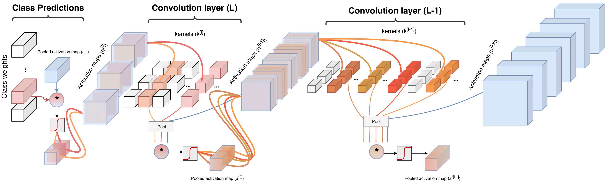

## Class Feature Pyramids


[](https://github.com/alexandrosstergiou/Class_Feature_Visualization_Pyramid/blob/master/LICENSEhttps://github.com/GKalliatakis/DisplaceNet/blob/master/LICENSE)

[](https://twitter.com/intent/tweet?text=Class%20Feature%20Pyramids%20for%20Video%20Explanation&url=https://github.com/alexandrosstergiou/Class_Feature_Visualization_Pyramid&hashtags=PyTorch)


--------------------------------------------------------------------------------
### Introduction
<p align="justify">We introduce <i>Class Feature Pyramids</i>, a method that traverses an entire network structure and
 incrementally discovers kernels at different network depths that are informative for a specific class.
 Our method does not depend on the network’s architecture or the type of 3D convolutions, supporting grouped and depth-wise convolutions,
 convolutions in fibers, and convolutions in branches.</p>

<p align="center">
   
</p>

<p align="center">
<i>1<sup>st</sup> 2019 ICCV Workshop on <br> <a href="http://xai.unist.ac.kr/workshop/2019/" >Interpreting and Explaining Visual Artificial Intelligence Models</a> &nbsp;&nbsp;&nbsp;
</i>
<br>
<a href="https://arxiv.org/pdf/1909.08611v1.pdfpdf" target="_blank">[arXiv preprint]</a>
</p>


### Dependencies
Make sure that the following packages are installed in your machine:
* OpenCV
* Scipy
* PyTorch
Alternatively they cane be dowloaded as:

```
$ pip install opencv-python scipy torch torchvision
```

We offer an additional frame-reading method based on a frame SQL database, in the case that the frames are stores in such format (for smaller inode requirements and faster loading times).


Models and weights used in the paper, are based on the following repositories:

* [Kensho Hara's original implementation of "Can Spatiotemporal 3D CNNs Retrace the History of 2D CNNs and ImageNet?"](https://github.com/kenshohara/3D-ResNets-PyTorch)
* [Yunpeng Chen's original implementation of "Multi-Fiber Networks for Video Recognition"](https://github.com/cypw/PyTorch-MFNet)
* [Yana Hasson's PyTorch implementation of "Quo Vadis, Action Recognition? A New Model and the Kinetics Dataset"](https://github.com/hassony2/kinetics_i3d_pytorch)

### Installation

Please make sure, Git is installed in your machine:
```sh
$ sudo apt-get update
$ sudo apt-get install git
$ git clone https://github.com/alexandrosstergiou/Class_Feature_Visualization_Pyramid.git
```


### Getting started

<p align="center">

</p>

For using Class Feature Pyramids ensure that the main file is called with the following parser arguments:
```
python main.py
--num_classes [number of classes]
--model_weights [The filepath of the .pth weight file]
--frame_dir [directory of the video/clip]
--frames_start [starting frame number]
--frames_end [ending frame number]
--label [class to backstep for]
--threshold [numeric threshold for the kernel-based activations]
--backprop_depth [backwards network depth to backstep to - if 1 only the predictions layer is used]
--visualisation_method [defines the kernels to be visualised]
```

The network to be used as well as the number of GPUs are currently manually defined in the code (lines 513 & 517). However, they will be integrated in the parser soon.

Apart from creating a folder containing layer and kernel based saliency tubes, a `JSON` file is also created that contains a full list of all connections across kernels and layers for the specific class and example chosen. This can be used in conjunction with a visualising tool such as [D3](https://github.com/d3/d3).

---

### Results
Example results of biking class of HMDB-51 with different networks and network depths:

<p align="center">
   
</p>


### Performance of Class Feature Pyramids

Running times were based on a 2 x Nvidia GTX1080Ti machine with an Intel i7-8700 CPU.

| Network | GFLOPS | Back-step time (msec) | # layers | theta |
|:-------------:|:---------:|:-----:|:----:|:----:|
|Multi-FiberNet | 22.70 | 24.43 | 3 | 0.6 |
|I3D | 55.79 | 23.21 | 1 + mixed5c | 0.65 |
|ResNet50-3D | 80.32 | 21.39 | 3 | 0.55 |
|ResNet101-3D| 110.98| 39.48 | 3 | 0.6 |
|ResNet152-3D | 148.91| 31.06 | 3 | 0.6 |
|ResNeXt101-3D | 76.96| 70.49 | 3 | 0.6 |


---

### Citing Class Feature Pyramids
If you use our code in your research or wish to refer to the baseline results, please use the following BibTeX entry:

    @article{stergiou2019classfeaturepyramid,
    title={Class Feature Pyramids for Video Explanation},
    author={Stergiou, Alexandros and Kapidis, Georgios and Kalliatakis, Grigorios and Chrysoulas, Christos and Veltkamp, Remco and Poppe, Ronald},
    journal={arXiv preprint arXiv:1909.08611},
    year={2019}
    }

<p align="center">
  :octocat:  <br>
  <i>We use GitHub issues to track public bugs. Report a bug by <https://github.com/alexandrosstergiou/Class_Feature_Visualization_Pyramid/issues">opening a new issue.</a></i><br>
</p>
